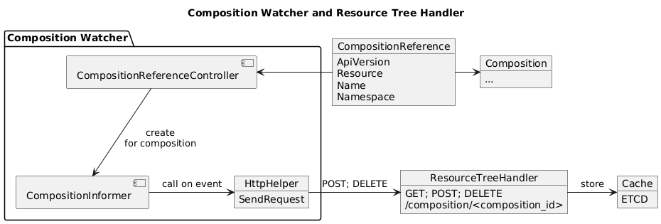

# Composition Watcher

This controller uses the CompositionReference Custom Resource Definition to instantiate informers that continuosly monitor composition resources. For each type of event, the respective request is forwarded to the webservice [Resource Tree Handler](https://github.com/krateoplatformops/resource-tree-handler) to generate and cache the resource tree.


## Summary

1. [Overview](#overview)
2. [Architecture](#architecture)
3. [Examples](#examples)
4. [Configuration](#configuration)

## Overview

When creating a CompositionReference Custom Resource, the controller will start the life cycle of the informer and monitor the cluster for create/delete/update events and notify the [Resource Tree Handler](https://github.com/krateoplatformops/resource-tree-handler).

## Architecture




## Examples

In the following example, the Composition Watcher will start an informer for the composition "demolive":

```yaml
apiVersion: resourcetrees.krateo.io/v1
kind: CompositionReference
metadata:
  name: fireworksapp-demolive
  namespace: resource-tree-test
spec:
  filters:
    exclude:
    - apiVersion: "templates.krateo.io/v1alpha1"
      resource: "collections"
    - apiVersion: "templates.krateo.io/v1alpha1"
      resource: "widgets"
    - apiVersion: "v1"
      resource: "configmaps"
      name: "^composition-"
  reference:
    apiVersion: composition.krateo.io/v1-1-3
    name: demolive
    namespace: fireworksapp-system
    resource: fireworksapps
```

## Configuration

To configure the controller, refer to the example above. The custom resource can also be configured with a set of filters to exclude some resources from the resource tree. Each of `apiVersion`, `resource`, and `name` is evaluated independetly, and all must be true to filter a given resource. 

A field of the filter is true if the following criterias are met:
 - the field is missing or empty;
 - the field perfectly matches the resource;
 - the field is a regex and there is a match in the resource.

### Reconcile time
The cache invalidation period of the webservices matches the reconcile time of the controller. To customize the reconcile time of the controller, modify the environment variable "RECONCILE_REQUEUE_AFTER". This variable is also available in the HELM chart at `.Values.reconcileAfter`.

### Installation
This controller can be installed with the respective [HELM chart](https://github.com/krateoplatformops/composition-watcher-chart).